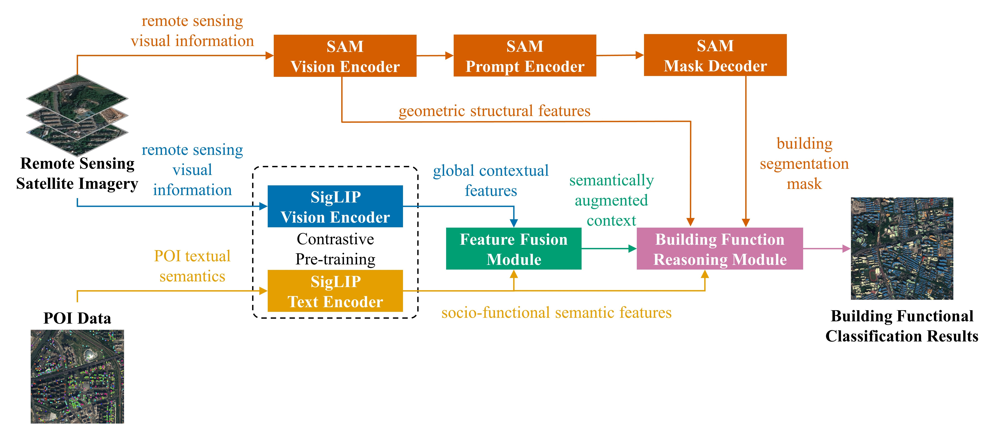
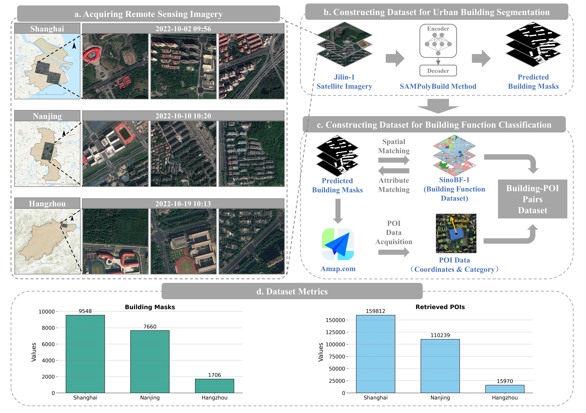

## Introduction

This repository contains the code implementation for the paper **"Cross-Modal Semantic Alignment and Fusion of POIs and Remote Sensing Imagery via Pre-Trained Models for Urban Building Function Classification"**.

We propose a multimodal architecture that leverages pre-trained vision–language models to achieve deep semantic alignment and fusion between remote sensing imagery and POI-derived textual information. By integrating building-level visual features, surrounding POI semantics, and spatial context through mask-guided cross-attention reasoning, the framework enables fine-grained urban building function classification.





## Installation
This project follows the same runtime environment as [RSRefSeg](https://github.com/KyanChen/RSRefSeg), please refer to it for setup details.


## Dependencies
- Linux system, Windows is also supported
- Python 3.10+, recommended to use 3.11
- PyTorch 2.0 or higher, recommended to use 2.3
- CUDA 11.7 or higher, recommended to use 12.1
- MMCV 2.0 or higher, recommended to use 2.2
- Transformers 4.49.0


## Dataset Preparation
<details open>


### BuiltPOI-YRD (Building Understanding with Image-derived Local Textures and POI in the YRD)
This project is based on a self-constructed multimodal dataset. Remote sensing imagery is acquired from the Jilin-1 satellites, and POI data is collected from AMap (Gaode Map).

The dataset is organized at the building level, where each sample includes a remote sensing image patch, a building mask with function label, and associated nearby POIs with semantic categories, forming aligned visual–semantic pairs for multimodal building function classification.



#### Data Access
- Download link for BuiltPOI-YRD (directly usable for training in this project): 
  1. 链接: https://pan.baidu.com/s/18d1MDiH_D38XOQxg1MEaWQ?pwd=5wp7 提取码: 5wp7 
  2. 链接: https://pan.baidu.com/s/1kIOpXUrpcSS7bpmo2Ye3Fg?pwd=a3jp 提取码: a3jp 

- Download link for the raw data (without preprocessing):
  链接: https://pan.baidu.com/s/13luPZtvEKD-TY9t6k5z3ew?pwd=bg39 提取码: bg39 


#### Pretrained Weights Access
- Download link for pretrained weights in this study: 
  链接: https://pan.baidu.com/s/18fd4guiFHzAPlbBpuMAkwA?pwd=yyrr 提取码: yyrr 


#### Organization Format
```
${DATASET_ROOT} # Dataset root directory:
────datainfo
    ├── train.jsonl
    ├── val.jsonl
    └── test.jsonl
────dataset
    ├── JL_Images
    └── building_labels
        
```

#### Data Preprocessing Code
We provide scripts to construct the BuiltPOI-YRD dataset, please refer to [these Python scripts](make_dataset/).
Users are required to configure the paths and parameters according to their specific runtime environment. 


</details>


## Model Training

### Config Files and Key Parameter Explanations

Configuration files for different model sizes are available in the "[configs](configs)" folder. The configuration files corresponding to different ablation study variants are provided in the "[train_results](train_results)" folder.  

When training ablation variants, please copy the "config-b.py" file from the "[train_results](train_results)" directory to "[configs](configs)" folder, and replace the "model.py" file in "[train_results](train_results)" directory with the corresponding version provided in "[rsris/models](rsris/models)" directory. Each "config-b.py" file is paired with a specific "model.py", so make sure to use the matching versions. Make sure the file paths and configurations are correctly updated before running the training script.  

The "config-b.py" file is used for both training and evaluation, while "config-b-inference.py" is specifically designed for inference.

Config files maintain consistency with the MMSegmentation API and usage. Below are some key parameter explanations.  


<details>

**Parameter Explanations**:

- `work_dir`: Output path for model training, usually does not need modification.
- `data_root`: Dataset root directory, **modify to the absolute path of the dataset root directory**.
- `batch_size`: Batch size per GPU, **needs adjustment depending on VRAM size**.
- `max_epochs`: Maximum number of training epochs, usually does not need modification.
- `val_interval`: Interval for validation set, usually does not need modification.
- `vis_backends/WandbVisBackend`: Configuration for network-side visualization tools, **open the comment if needed, requires registering an account on `wandb` website to view visual results of the training process in a web browser**.
- `resume`: Whether to resume from checkpoint, usually does not need modification.
- `load_from`: Pre-trained checkpoint path for the model, usually does not need modification.
- `init_from`: Pre-trained checkpoint path for the model, usually keep as None unless resuming from a checkpoint, in which case modify it accordingly.
- `default_hooks/CheckpointHook`: Configuration for checkpoint saving during model training, usually does not need modification.
- `model/lora_cfg`: Configuration for efficient model tuning, usually does not need modification.
- `model/backbone`: Visual backbone of SAM model, **adjust according to actual needs**, base corresponds to `sam-vit-base`, large corresponds to `sam-vit-large`, huge corresponds to `sam-vit-huge`.
- `model/clip_vision_encoder`: Visual encoder of the CLIP model, usually does not need modification.
- `model/clip_text_encoder`: Text encoder of the CLIP model, usually does not need modification.
- `model/sam_prompt_encoder`: Prompt encoder of the SAM model, usually does not need modification.
- `model/sam_mask_decoder`: Decoder of the SAM model, usually does not need modification.
- `model/decode_head`: Pseudo decode head of the RSRefSeg model, usually does not need modification.
- `AMP training config`: Configuration for mixed precision training. If not using DeepSpeed training, uncomment this section. Usually does not need modification.
- `DeepSpeed training config`: Configuration for DeepSpeed training. If using DeepSpeed training, uncomment this section and comment out `AMP training config`. Note that DeepSpeed training is not supported on Windows.
- `dataset_type`: Dataset type, usually does not need modification.
- `data_preprocessor/mean/std`: Mean and standard deviation for data preprocessing, usually does not need modification.

</details>


## Model Training

```shell
python tools/train.py configs/config-b.py  # Replace 'config-b.py' with the desired config file
```


## Model Testing

```shell
python tools/test.py configs/config-b.py --checkpoint ${CHECKPOINT_FILE}  # Replace 'config-b.py' with the desired config file, 'CHECKPOINT_FILE' with the desired checkpoint file
```


## Model Prediction

```shell
python demo/inference.py --config configs/config-b-inference.py --checkpoint ${CHECKPOINT_FILE} --out-dir ${OUTPUT_DIR} # 'config-b-inference.py' with the desired config file, 'CHECKPOINT_FILE' with the desired checkpoint file, and 'OUTPUT_DIR' with the output directory for prediction results.

```
If you do not wish to perform inference on the full test set, you can create a custom "test-1.jsonl" file containing only the samples you want to evaluate. Then, update the ann_file path in the test_dataloader section of "config-b-inference.py" to point to your custom file.


## Acknowledgments

Our project was developed based on [RSRefSeg](https://github.com/KyanChen/RSRefSeg) and [MMSegmentation](https://github.com/open-mmlab/mmsegmentation). We thank the developers of these projects.


## Citation

1. The citation of our study will be provided once our paper is available.

2. Our project builds upon the RSRefSeg framework. If you find it useful in your research, we kindly recommend citing the original work using the following BibTeX.

```
@article{chen2025rsrefseg,
  title={RSRefSeg: Referring Remote Sensing Image Segmentation with Foundation Models},
  author={Chen, Keyan and Zhang, Jiafan and Liu, Chenyang and Zou, Zhengxia and Shi, Zhenwei},
  journal={arXiv preprint arXiv:2501.06809},
  year={2025}
}
```


## License

This project uses the [Apache 2.0 open source license](LICENSE).


## Contact

For further questions, feel free to contact us.